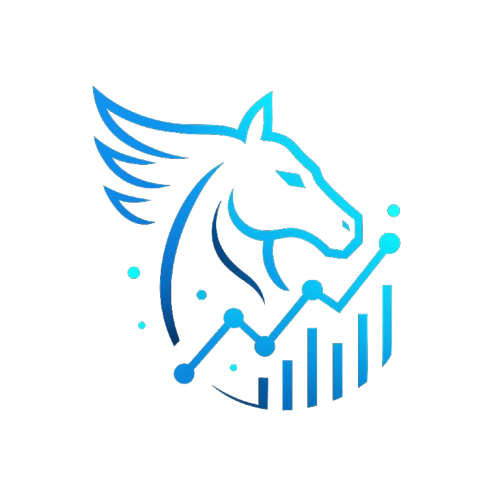

# Pegasus EntityLogger Visualizer

A modern, fully client-side web tool for visualizing and analyzing entity logs generated by the Pegasus mod for Minecraft Forge 1.20.1.



## Features

- **Drag-and-drop or file picker upload** for Pegasus EntityLogger CSV files
- **Dark/light mode** inspired by Spark (JetBrains Mono font, animated buttons)
- **Entity aggregation** by type and name, with expandable coordinate breakdowns
- **TPS (Ticks Per Second) display** and timeline graphs (if logs are timestamped)
- **Search/filter bar** for real-time entity filtering
- **Coordinate range filtering** (X, Y, Z) per file
- **Sticky file headers** for easy navigation
- **Session persistence** (localStorage): restores uploaded files, expanded/collapsed state, filters, etc.
- **Merge logs** and export merged/filtered data as CSV
- **Keyboard navigation** for accessibility
- **Open source** and deployable as a static site (GitHub Pages, Netlify, etc.)

## Usage

1. **Clone or download this repository.**
2. Open `index.html` in your browser (no server required).
3. Drag and drop or select one or more Pegasus EntityLogger CSV files.
4. Explore, filter, and analyze your entity data interactively.
5. Use the export and merge features as needed.

## Pegasus Log Format
- Each CSV file contains lines like:
  - `TPS,20,0,0,0,0,0`
  - `Entity,zombie,overworld,653,67,984,1`
  - `Item,stone,overworld,7892,-21,2350,64`
- Format: `Type,Name,Dimension,X,Y,Z,Quantity`
- No headers are present in the files.SS

## Development

- **No frameworks**: Only HTML, CSS, and vanilla JavaScript
- **CSV parsing**: [PapaParse](https://www.papaparse.com/) (CDN)
- **Charts**: [Chart.js](https://www.chartjs.org/) (CDN)
- **Styling**: Custom CSS inspired by [Spark Viewer](https://github.com/lucko/spark-viewer)

### Folder Structure
```
index.html
main.js
assets/
  logo_no_background.png
  ... (favicons, manifest, etc.)
style/
  base.css (inspired by Spark Viewer)
  main.css
```

## Open Source

This project is open source and can be forked. Don't hesitate to contribute!

---

*Made with ❤️ by BENZOOgataga, for the Minecraft community.*
